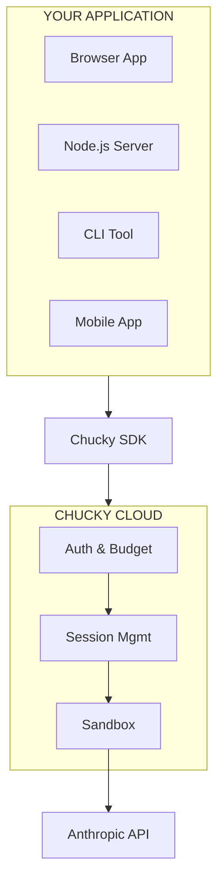
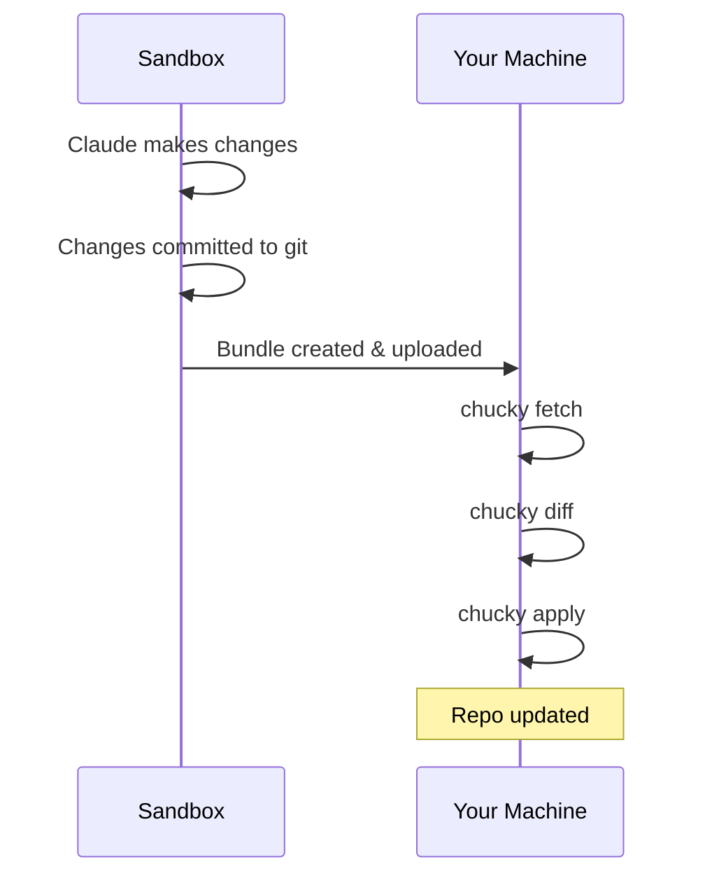
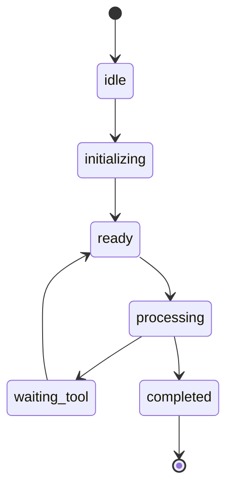

Chucky sits between your application and Claude, providing managed infrastructure for AI agent execution.

## System Overview



**Chucky Cloud components:**

| Component | Responsibilities |
|-----------|-----------------|
| **Auth & Budget** | JWT validation, budget tracking, rate limiting, usage metering |
| **Session Mgmt** | Multi-turn state, context management, persistence, resume/fork |
| **Sandbox** | Isolated container, file system access, shell execution, git integration |

## Request Flow

### 1. Token Creation (Your Server)

Your backend creates a JWT token with user identity and budget limits:

```typescript
// Your server - never expose the secret
const token = await createToken({
  userId: 'user-123',
  projectId: process.env.CHUCKY_PROJECT_ID,
  secret: process.env.CHUCKY_HMAC_SECRET,
  budget: createBudget({ aiDollars: 5, computeHours: 1, window: 'day' }),
});
```

### 2. SDK Connection (Your App)

Your application connects via WebSocket with the token:

```typescript
// Browser, Node.js, or CLI - same SDK
const client = new ChuckyClient({ token });
const session = client.createSession();
```

### 3. Edge Processing (Chucky Cloud)

When a request arrives:
1. **JWT validated** - Signature verified with your HMAC secret
2. **Budget checked** - User's remaining budget calculated
3. **Session loaded** - Previous context restored if resuming
4. **Sandbox started** - Isolated container with your workspace

### 4. Agent Execution (Sandbox)

Inside the sandbox:
- Your entire codebase is available
- Claude can read/write files
- Claude can run shell commands
- Tools execute and return results
- Git commits are tracked

### 5. Response Streaming

Results stream back through the same WebSocket:
- Real-time token streaming
- Tool call notifications
- Final results with cost breakdown

---

## Tool Execution Locations

Tools can execute in different places depending on your needs:

<CardGroup cols={3}>
  <Card title="Browser Tools" icon="browser">
    **Runs in user's browser**

    - DOM manipulation
    - Local storage
    - Alerts/modals
    - Canvas drawing
    - API calls
  </Card>
  <Card title="Sandbox Tools" icon="cloud">
    **Runs in Chucky's cloud**

    - File read/write
    - Shell commands
    - Git operations
    - Build/test
    - Database access
  </Card>
  <Card title="Host Tools" icon="desktop">
    **Runs on user's machine** (Possession Mode)

    - HostBash
    - HostRead
    - HostWrite
    - HostEdit
    - HostGlob/HostGrep
  </Card>
</CardGroup>

### Browser Tools

Execute in the user's browser with full DOM access:

```typescript
const highlightTool = {
  name: 'highlight',
  handler: async ({ selector }) => {
    document.querySelector(selector).style.background = 'yellow';
    return textResult('Done');
  }
};
```

### Sandbox Tools

Execute in Chucky's cloud with file/shell access:

```typescript
// These tools are built-in to the sandbox
// Claude can: Read, Write, Edit, Bash, Glob, Grep
await session.send('Create a new React component');
```

### Host Tools (Possession Mode)

Execute on the user's local machine:

```bash
chucky prompt "Fix TypeScript errors in my project" --allow-possession
```

Claude reasons in the cloud, but `HostBash`, `HostRead`, `HostWrite` execute locally.

---

## Sandbox Environment

Each session runs in an isolated container:

### What's Available

| Resource | Details |
|----------|---------|
| **File System** | Your entire workspace (from `chucky deploy`) |
| **Git** | Full git history, can commit changes |
| **Shell** | Bash with common tools (node, npm, python, etc.) |
| **Network** | Outbound HTTP/HTTPS for API calls |
| **Memory** | Configurable per plan |
| **CPU** | Shared, with fair scheduling |

### Security Boundaries

- **Isolated**: Each session runs in its own container
- **Ephemeral**: Containers destroyed after session ends
- **No inbound**: No direct network access to sandbox
- **Resource limited**: CPU, memory, and time limits enforced

### Git Bundle Workflow

Changes made in the sandbox are packaged as git bundles:



---

## Session States

Sessions progress through defined states:



| State | Description |
|-------|-------------|
| `idle` | Session created, not yet connected |
| `initializing` | WebSocket connecting, loading context |
| `ready` | Ready to receive messages |
| `processing` | Claude is thinking/responding |
| `waiting_tool` | Waiting for tool execution result |
| `completed` | Session finished |

---

## Budget Enforcement

Budgets are enforced at multiple levels:

### Token Level

```typescript
budget: {
  ai: 5_000_000,      // $5 in microdollars
  compute: 3600,      // 1 hour in seconds
  window: 'day',
  windowStart: '2024-01-15T00:00:00Z'
}
```

### Edge Enforcement

Before each request:
1. Calculate user's usage in current window
2. Check against budget limits
3. Reject if exceeded

### Real-time Tracking

During execution:
- Token usage tracked per request
- Compute time measured
- Costs calculated and reported

### Response

```typescript
{
  type: 'result',
  subtype: 'success',
  result: '...',
  total_cost_usd: 0.0234,
  usage: {
    input_tokens: 1500,
    output_tokens: 800
  }
}
```

---

## High Availability

Chucky runs on Cloudflare's edge network:

- **Global distribution**: Requests routed to nearest edge
- **Auto-scaling**: Handles traffic spikes automatically
- **No cold starts**: Workers always warm
- **99.9% uptime**: Enterprise-grade reliability

---

## Next Steps

<CardGroup cols={2}>
  <Card title="Quickstart" icon="rocket" href="/quickstart">
    Deploy your first agent
  </Card>
  <Card title="Tools" icon="wrench" href="/concepts/tools">
    Define custom tools
  </Card>
  <Card title="Sessions" icon="comments" href="/concepts/sessions">
    Multi-turn conversations
  </Card>
  <Card title="CLI" icon="terminal" href="/cli">
    Command-line interface
  </Card>
</CardGroup>
