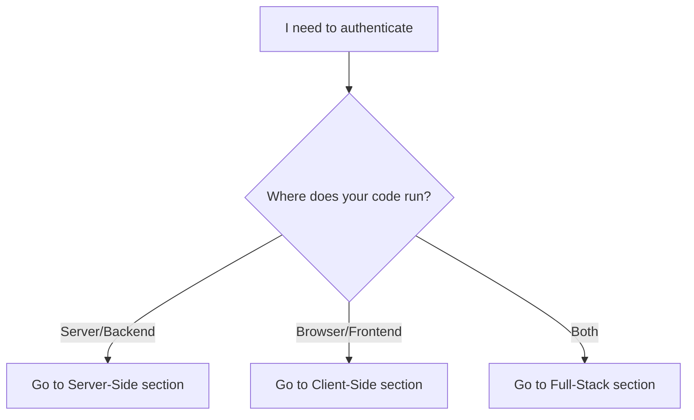

# Authentication

Chucky uses JWT tokens for authentication. Your server creates tokens with your HMAC secret; your client uses those tokens with the SDK. Answer one question to find your path.

## Which Path Should I Take?



---

## Server-Side: Create Tokens {#server-side}

Create tokens on your backend server using your HMAC secret. Never expose the secret to clients.

<Warning>
Your HMAC secret must stay on the server. Never include it in browser or mobile code.
</Warning>

<Tip>
Get your **Project ID** and **HMAC secret** from [app.chucky.cloud](https://app.chucky.cloud) project settings.
</Tip>

```typescript
// create-token.ts - Run with: npx tsx create-token.ts
import { createToken, createBudget } from '@chucky.cloud/sdk';

const PROJECT_ID = process.env.CHUCKY_PROJECT_ID;
const HMAC_SECRET = process.env.CHUCKY_HMAC_SECRET;

if (!PROJECT_ID || !HMAC_SECRET) {
  console.error('Set CHUCKY_PROJECT_ID and CHUCKY_HMAC_SECRET environment variables');
  process.exit(1);
}

const token = await createToken({
  userId: 'user-123',
  projectId: PROJECT_ID,
  secret: HMAC_SECRET,
  expiresIn: 3600,
  budget: createBudget({
    aiDollars: 1.00,
    computeHours: 1,
    window: 'day',
  }),
});

console.log('Token created:', token.substring(0, 30) + '...');
// Return this token to your client
```

**Expected Output:**
```
Token created: eyJhbGciOiJIUzI1NiIsInR5cCI6...
```

<Note>
Your token will be different - it contains your user ID and budget encoded as a JWT.
</Note>

---

## Client-Side: Use Tokens {#client-side}

Use a token from your backend to connect to Chucky. The token contains budget limits - you don't need the HMAC secret.

```typescript
// use-token.ts - Run with: npx tsx use-token.ts
import { ChuckyClient, getResultText } from '@chucky.cloud/sdk';

const token = process.env.CHUCKY_TOKEN;

if (!token) {
  console.error('Set CHUCKY_TOKEN environment variable (from your backend)');
  process.exit(1);
}

const client = new ChuckyClient({ token });

const result = await client.prompt(
  'What is 2 + 2?',
  { model: 'claude-sonnet-4-5-20250929' }
);

console.log('Claude:', getResultText(result));
client.close();
```

**Expected Output:**
```
Claude: 2 + 2 equals 4.
```

<Note>
Claude's exact wording may vary, but the answer will be mathematically correct.
</Note>

---

## Full-Stack: Both {#full-stack}

Building an app with a backend and frontend? Here's the complete flow:

1. **Backend** creates a token (using HMAC secret)
2. **Frontend** receives and uses the token (never sees secret)

<CardGroup cols={2}>
  <Card title="Server-Side" icon="server" href="#server-side">
    Create tokens with your HMAC secret
  </Card>
  <Card title="Client-Side" icon="browser" href="#client-side">
    Use tokens in browser or mobile
  </Card>
</CardGroup>

For a production example with user tiers, see the [Next.js token endpoint example](/advanced/token-endpoint) in Advanced guides.

---

## Deep Dive {#deep-dive}

For advanced configuration and security details:

<CardGroup cols={2}>
  <Card title="Token Options" href="#token-options">
    All parameters for createToken
  </Card>
  <Card title="Budget Configuration" href="#budget-configuration">
    AI and compute budget limits
  </Card>
  <Card title="Token Permissions" href="#token-permissions">
    Restrict tools, models, and turns
  </Card>
  <Card title="Best Practices" href="#best-practices">
    Security recommendations
  </Card>
</CardGroup>

### Token Options {#token-options}

| Option | Type | Required | Description |
|--------|------|----------|-------------|
| `userId` | `string` | Yes | Unique identifier for the user |
| `projectId` | `string` | Yes | Your project ID from portal settings |
| `secret` | `string` | Yes | Your HMAC secret from portal settings |
| `budget` | `TokenBudget` | Yes | Budget configuration |
| `expiresIn` | `number` | No | Token validity in seconds (default: 3600) |
| `permissions` | `object` | No | Optional permission constraints |
| `sdkConfig` | `object` | No | SDK configuration overrides |

### Budget Configuration {#budget-configuration}

Budgets control how much each user can spend:

- **AI Budget**: Cost limit for Claude API calls (in dollars)
- **Compute Budget**: Time limit for sandbox execution (in hours)

| Window | Description |
|--------|-------------|
| `hour` | Resets every hour |
| `day` | Resets every 24 hours |
| `week` | Resets every 7 days |
| `month` | Resets on billing anchor day |

<Note>
  AI budget is specified in **microdollars** (1 USD = 1,000,000 microdollars) for precision in the raw format.
</Note>

### Token Permissions {#token-permissions}

Restrict what users can do with their token:

| Option | Type | Description |
|--------|------|-------------|
| `tools` | `string[]` | Whitelist of allowed tool names |
| `blockedTools` | `string[]` | Blacklist of blocked tool names |
| `maxTurns` | `number` | Maximum conversation turns |
| `model` | `string` | Force a specific model |

### Best Practices {#best-practices}

<Warning>
  **Never expose your HMAC secret** to clients. Always create tokens on your server.
</Warning>

<AccordionGroup>
  <Accordion title="Short-lived tokens">
    Use short expiration times (1 hour or less) and refresh tokens as needed. This limits exposure if a token is compromised.
  </Accordion>

  <Accordion title="Per-session tokens">
    Create a new token for each user session rather than reusing tokens. This provides better audit trails and security.
  </Accordion>

  <Accordion title="Conservative budgets">
    Start with small budgets and increase based on user needs. You can always create a new token with a larger budget.
  </Accordion>

  <Accordion title="Use permissions">
    Restrict tools and models based on user trust level. Free users might get limited tools, while premium users get full access.
  </Accordion>
</AccordionGroup>
