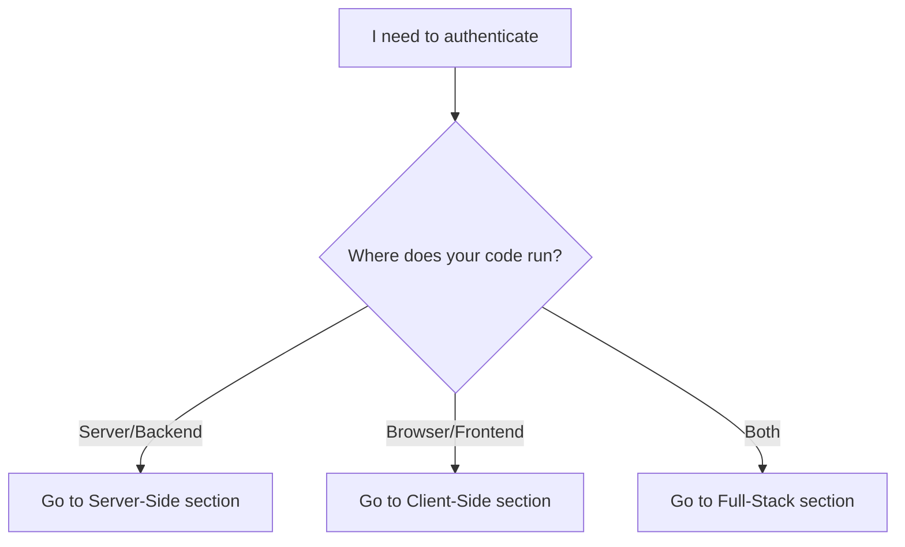

# Authentication

Chucky uses JWT tokens for authentication. Your server creates tokens with your HMAC secret; your client uses those tokens with the SDK. Answer one question to find your path.

## Which Path Should I Take?

---

## Server-Side: Create Tokens {#server-side}

PLACEHOLDER - Server-side token creation code will be added in Plan 02-02.

---

## Client-Side: Use Tokens {#client-side}

PLACEHOLDER - Client-side token usage code will be added in Plan 02-02.

---

## Full-Stack: Both {#full-stack}

PLACEHOLDER - Full-stack example combining server and client will be added in Plan 02-02.

---

## Deep Dive {#deep-dive}

For advanced configuration and security details:

<CardGroup cols={2}>
  <Card title="Token Options" href="#token-options">
    All parameters for createToken
  </Card>
  <Card title="Budget Configuration" href="#budget-configuration">
    AI and compute budget limits
  </Card>
  <Card title="Token Permissions" href="#token-permissions">
    Restrict tools, models, and turns
  </Card>
  <Card title="Best Practices" href="#best-practices">
    Security recommendations
  </Card>
</CardGroup>

### Token Options {#token-options}

| Option | Type | Required | Description |
|--------|------|----------|-------------|
| `userId` | `string` | Yes | Unique identifier for the user |
| `projectId` | `string` | Yes | Your project ID from portal settings |
| `secret` | `string` | Yes | Your HMAC secret from portal settings |
| `budget` | `TokenBudget` | Yes | Budget configuration |
| `expiresIn` | `number` | No | Token validity in seconds (default: 3600) |
| `permissions` | `object` | No | Optional permission constraints |
| `sdkConfig` | `object` | No | SDK configuration overrides |

### Budget Configuration {#budget-configuration}

Budgets control how much each user can spend:

- **AI Budget**: Cost limit for Claude API calls (in dollars)
- **Compute Budget**: Time limit for sandbox execution (in hours)

| Window | Description |
|--------|-------------|
| `hour` | Resets every hour |
| `day` | Resets every 24 hours |
| `week` | Resets every 7 days |
| `month` | Resets on billing anchor day |

<Note>
  AI budget is specified in **microdollars** (1 USD = 1,000,000 microdollars) for precision in the raw format.
</Note>

### Token Permissions {#token-permissions}

Restrict what users can do with their token:

| Option | Type | Description |
|--------|------|-------------|
| `tools` | `string[]` | Whitelist of allowed tool names |
| `blockedTools` | `string[]` | Blacklist of blocked tool names |
| `maxTurns` | `number` | Maximum conversation turns |
| `model` | `string` | Force a specific model |

### Best Practices {#best-practices}

<Warning>
  **Never expose your HMAC secret** to clients. Always create tokens on your server.
</Warning>

<AccordionGroup>
  <Accordion title="Short-lived tokens">
    Use short expiration times (1 hour or less) and refresh tokens as needed. This limits exposure if a token is compromised.
  </Accordion>

  <Accordion title="Per-session tokens">
    Create a new token for each user session rather than reusing tokens. This provides better audit trails and security.
  </Accordion>

  <Accordion title="Conservative budgets">
    Start with small budgets and increase based on user needs. You can always create a new token with a larger budget.
  </Accordion>

  <Accordion title="Use permissions">
    Restrict tools and models based on user trust level. Free users might get limited tools, while premium users get full access.
  </Accordion>
</AccordionGroup>
