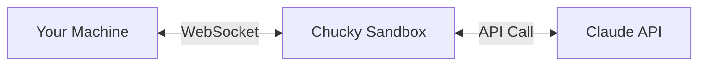

<Warning>
**Possession Mode gives Claude direct access to your local machine.** It can execute shell commands, read/write files, and modify your filesystem. Use with caution and only in trusted environments.
</Warning>

Possession Mode is a powerful feature that enables Claude (running in the Chucky sandbox) to control your local machine through host tools. This creates a unique "reverse proxy" pattern where:

1. You send a prompt to Claude in the cloud
2. Claude can call tools that execute **on your machine**
3. Results are sent back to Claude to continue the conversation

This is perfect for:
- **Automated coding tasks** - Let Claude explore your codebase and make changes
- **System administration** - Run commands and analyze output
- **File processing** - Read, transform, and write files
- **Development workflows** - Build, test, and deploy from natural language

## Quick Start

```bash
chucky prompt "List all JavaScript files and count the lines of code" \
  --project my-project \
  --allow-possession \
  --dangerously-skip-permissions
```

<Note>
The `--dangerously-skip-permissions` flag is required to bypass Claude's built-in permission prompts for tool execution.
</Note>

## Available Host Tools

When Possession Mode is enabled, Claude has access to these tools:

### HostBash

Execute any shell command on your machine.

```bash
# Claude can run commands like:
ls -la
git status
npm test
docker ps
```

**Parameters:**
- `command` (required): The bash command to execute
- `cwd` (optional): Working directory
- `timeout` (optional): Timeout in milliseconds (default: 30000)

### HostRead

Read file contents from your filesystem.

**Parameters:**
- `path` (required): Path to the file
- `encoding` (optional): File encoding (default: utf-8)

### HostWrite

Write content to a file.

**Parameters:**
- `path` (required): Path to the file
- `content` (required): Content to write
- `encoding` (optional): File encoding (default: utf-8)

### HostEdit

Edit a file by finding and replacing text.

**Parameters:**
- `path` (required): Path to the file
- `old_string` (required): String to find
- `new_string` (required): Replacement string
- `replace_all` (optional): Replace all occurrences (default: false)

### HostGlob

Find files matching a glob pattern.

**Parameters:**
- `pattern` (required): Glob pattern (e.g., `**/*.ts`)
- `cwd` (optional): Base directory
- `ignore` (optional): Patterns to ignore (default: `node_modules/**`, `.git/**`)

### HostGrep

Search for patterns in files.

**Parameters:**
- `pattern` (required): Regex pattern to search for
- `path` (optional): Directory to search in
- `glob` (optional): File pattern filter
- `ignoreCase` (optional): Case-insensitive search
- `maxResults` (optional): Maximum results (default: 100)

## Example Use Cases

### Code Exploration

```bash
chucky prompt "Find all TODO comments in the codebase and create a summary" \
  --project my-project \
  --allow-possession \
  --dangerously-skip-permissions
```

### Automated Refactoring

```bash
chucky prompt "Rename all instances of 'oldFunction' to 'newFunction' in the src folder" \
  --project my-project \
  --allow-possession \
  --dangerously-skip-permissions
```

### Build and Test

```bash
chucky prompt "Run the test suite and explain any failures" \
  --project my-project \
  --allow-possession \
  --dangerously-skip-permissions
```

### Git Operations

```bash
chucky prompt "Show me the recent commits and summarize what changed" \
  --project my-project \
  --allow-possession \
  --dangerously-skip-permissions
```

### File Generation

```bash
chucky prompt "Create a new React component called UserProfile with TypeScript" \
  --project my-project \
  --allow-possession \
  --dangerously-skip-permissions
```

## Restricting Tools

You can limit which host tools are available:

```bash
# Only allow read operations
chucky prompt "Analyze my codebase" \
  --project my-project \
  --allow-possession \
  --allowed-tools "HostRead,HostGlob,HostGrep" \
  --dangerously-skip-permissions
```

```bash
# Disable write operations
chucky prompt "Explore the project" \
  --project my-project \
  --allow-possession \
  --disallowed-tools "HostWrite,HostEdit,HostBash" \
  --dangerously-skip-permissions
```

## Security Considerations

<Warning>
Possession Mode is powerful but potentially dangerous. Consider these precautions:
</Warning>

1. **Use in isolated environments** - Consider running in a VM or container
2. **Limit tool access** - Use `--allowed-tools` to restrict capabilities
3. **Review before running** - For destructive operations, review Claude's plan first
4. **Use version control** - Have git backups before file modifications
5. **Network isolation** - Be aware that HostBash can make network requests

## How It Works



1. CLI connects to Chucky sandbox via WebSocket
2. Host tools are registered as MCP server tools
3. Claude decides when to call tools based on your prompt
4. Tool calls are sent back to your CLI
5. CLI executes the tool locally and returns results
6. Claude continues with the results

## Integration with Workspaces

If your project has a deployed workspace, Claude has access to **both**:
- **Host tools** - Execute on your local machine
- **Workspace tools** - Execute in the cloud sandbox

This enables powerful hybrid workflows where Claude can compare local and remote environments, sync files, or run operations in both places.
