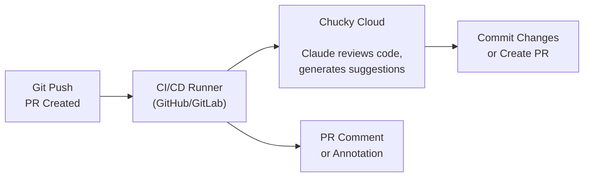

Integrate Claude into your CI/CD pipeline for automated PR reviews, changelog generation, code refactoring, and more.

## What You'll Build

Automated workflows that:
- Review pull requests and suggest improvements
- Generate changelogs from commits
- Refactor code on schedule
- Run code analysis and security audits

## Architecture



## GitHub Actions Examples

### PR Review Bot

```yaml
# .github/workflows/ai-review.yml
name: AI Code Review

on:
  pull_request:
    types: [opened, synchronize]

jobs:
  review:
    runs-on: ubuntu-latest
    permissions:
      contents: read
      pull-requests: write

    steps:
      - uses: actions/checkout@v4
        with:
          fetch-depth: 0

      - name: Setup Node.js
        uses: actions/setup-node@v4
        with:
          node-version: '20'

      - name: Install Chucky CLI
        run: npm install -g @chucky.cloud/cli

      - name: Get changed files
        id: changed
        run: |
          FILES=$(git diff --name-only origin/${{ github.base_ref }}...HEAD | head -20)
          echo "files=$FILES" >> $GITHUB_OUTPUT

      - name: Run AI Review
        env:
          CHUCKY_API_KEY: ${{ secrets.CHUCKY_API_KEY }}
        run: |
          chucky prompt "Review the following code changes for:
          - Security vulnerabilities
          - Performance issues
          - Code style improvements
          - Potential bugs

          Changed files:
          ${{ steps.changed.outputs.files }}

          Provide specific, actionable feedback." \
          --output-format json > review.json

      - name: Post Review Comment
        uses: actions/github-script@v7
        with:
          script: |
            const fs = require('fs');
            const review = JSON.parse(fs.readFileSync('review.json', 'utf8'));

            await github.rest.issues.createComment({
              owner: context.repo.owner,
              repo: context.repo.repo,
              issue_number: context.issue.number,
              body: `## AI Code Review\n\n${review.result}\n\n---\n*Powered by Chucky*`
            });
```

### Changelog Generator

```yaml
# .github/workflows/changelog.yml
name: Generate Changelog

on:
  release:
    types: [created]

jobs:
  changelog:
    runs-on: ubuntu-latest
    permissions:
      contents: write

    steps:
      - uses: actions/checkout@v4
        with:
          fetch-depth: 0

      - name: Install Chucky CLI
        run: npm install -g @chucky.cloud/cli

      - name: Get commits since last release
        id: commits
        run: |
          LAST_TAG=$(git describe --tags --abbrev=0 HEAD^ 2>/dev/null || echo "")
          if [ -n "$LAST_TAG" ]; then
            COMMITS=$(git log $LAST_TAG..HEAD --oneline)
          else
            COMMITS=$(git log --oneline -50)
          fi
          echo "commits<<EOF" >> $GITHUB_OUTPUT
          echo "$COMMITS" >> $GITHUB_OUTPUT
          echo "EOF" >> $GITHUB_OUTPUT

      - name: Generate Changelog
        env:
          CHUCKY_API_KEY: ${{ secrets.CHUCKY_API_KEY }}
        run: |
          chucky prompt "Generate a user-friendly changelog from these commits:

          ${{ steps.commits.outputs.commits }}

          Format as:
          ## What's New
          - Feature descriptions

          ## Bug Fixes
          - Fix descriptions

          ## Other Changes
          - Other changes

          Be concise. Group related changes. Use plain language." \
          --output-format json > changelog.json

      - name: Update Release
        uses: actions/github-script@v7
        with:
          script: |
            const fs = require('fs');
            const changelog = JSON.parse(fs.readFileSync('changelog.json', 'utf8'));

            await github.rest.repos.updateRelease({
              owner: context.repo.owner,
              repo: context.repo.repo,
              release_id: context.payload.release.id,
              body: changelog.result
            });
```

### Automated Refactoring

```yaml
# .github/workflows/refactor.yml
name: AI Refactoring

on:
  workflow_dispatch:
    inputs:
      task:
        description: 'Refactoring task'
        required: true
        default: 'Update deprecated API usage'
      path:
        description: 'Path to refactor (glob pattern)'
        required: true
        default: 'src/**/*.ts'

jobs:
  refactor:
    runs-on: ubuntu-latest
    permissions:
      contents: write
      pull-requests: write

    steps:
      - uses: actions/checkout@v4

      - name: Install Chucky CLI
        run: npm install -g @chucky.cloud/cli

      - name: Deploy workspace
        env:
          CHUCKY_API_KEY: ${{ secrets.CHUCKY_API_KEY }}
        run: chucky deploy

      - name: Run Refactoring
        env:
          CHUCKY_API_KEY: ${{ secrets.CHUCKY_API_KEY }}
        run: |
          chucky jobs create "${{ github.event.inputs.task }} in files matching ${{ github.event.inputs.path }}" \
            --wait --apply

      - name: Create Pull Request
        uses: peter-evans/create-pull-request@v5
        with:
          token: ${{ secrets.GITHUB_TOKEN }}
          commit-message: "refactor: ${{ github.event.inputs.task }}"
          title: "AI Refactoring: ${{ github.event.inputs.task }}"
          body: |
            This PR was automatically generated by AI refactoring.

            **Task:** ${{ github.event.inputs.task }}
            **Path:** ${{ github.event.inputs.path }}

            Please review the changes carefully.
          branch: ai-refactor-${{ github.run_id }}
```

### Security Audit

```yaml
# .github/workflows/security-audit.yml
name: AI Security Audit

on:
  schedule:
    - cron: '0 0 * * 0' # Weekly on Sunday
  workflow_dispatch:

jobs:
  audit:
    runs-on: ubuntu-latest

    steps:
      - uses: actions/checkout@v4

      - name: Install Chucky CLI
        run: npm install -g @chucky.cloud/cli

      - name: Run Security Audit
        env:
          CHUCKY_API_KEY: ${{ secrets.CHUCKY_API_KEY }}
        run: |
          chucky prompt "Perform a security audit of this codebase. Look for:

          1. SQL injection vulnerabilities
          2. XSS vulnerabilities
          3. Authentication/authorization issues
          4. Sensitive data exposure
          5. Insecure dependencies
          6. Hardcoded secrets
          7. CSRF vulnerabilities

          For each issue found, provide:
          - File and line number
          - Severity (Critical/High/Medium/Low)
          - Description
          - Recommended fix

          Format as a security report." \
          --output-format json > audit.json

      - name: Create Issue
        uses: actions/github-script@v7
        with:
          script: |
            const fs = require('fs');
            const audit = JSON.parse(fs.readFileSync('audit.json', 'utf8'));

            await github.rest.issues.create({
              owner: context.repo.owner,
              repo: context.repo.repo,
              title: `Security Audit - ${new Date().toISOString().split('T')[0]}`,
              body: `## Weekly Security Audit\n\n${audit.result}`,
              labels: ['security', 'automated']
            });
```

## GitLab CI Examples

### PR Review

```yaml
# .gitlab-ci.yml
ai-review:
  stage: review
  image: node:20
  script:
    - npm install -g @chucky.cloud/cli
    - |
      chucky prompt "Review the changes in this merge request:
      $(git diff origin/$CI_MERGE_REQUEST_TARGET_BRANCH_NAME...HEAD --stat)

      Focus on code quality and potential issues." \
      --output-format json > review.json
    - |
      # Post to GitLab MR
      curl --request POST \
        --header "PRIVATE-TOKEN: $GITLAB_TOKEN" \
        --data "body=$(cat review.json | jq -r .result)" \
        "$CI_API_V4_URL/projects/$CI_PROJECT_ID/merge_requests/$CI_MERGE_REQUEST_IID/notes"
  rules:
    - if: $CI_PIPELINE_SOURCE == "merge_request_event"
  variables:
    CHUCKY_API_KEY: $CHUCKY_API_KEY
```

## Using Background Jobs

For long-running tasks, use background jobs with webhooks:

```yaml
# .github/workflows/background-task.yml
name: Background AI Task

on:
  workflow_dispatch:
    inputs:
      task:
        description: 'Task description'
        required: true

jobs:
  start:
    runs-on: ubuntu-latest
    steps:
      - uses: actions/checkout@v4

      - name: Start Background Job
        env:
          CHUCKY_API_KEY: ${{ secrets.CHUCKY_API_KEY }}
        run: |
          npm install -g @chucky.cloud/cli
          chucky deploy

          # Start job with webhook callback
          chucky jobs create "${{ github.event.inputs.task }}" \
            --callback-url "${{ secrets.WEBHOOK_URL }}" \
            --callback-secret "${{ secrets.WEBHOOK_SECRET }}"
```

Then handle the webhook in your server:

```typescript
// api/webhooks/chucky.ts
import crypto from 'crypto';

export async function POST(req: Request) {
  const signature = req.headers.get('x-chucky-signature');
  const body = await req.text();

  // Verify signature
  const expected = crypto
    .createHmac('sha256', process.env.WEBHOOK_SECRET!)
    .update(body)
    .digest('hex');

  if (signature !== expected) {
    return new Response('Invalid signature', { status: 401 });
  }

  const payload = JSON.parse(body);

  if (payload.type === 'job.completed') {
    // Job finished - create PR, post comment, etc.
    await handleJobCompletion(payload);
  }

  return new Response('OK');
}
```

## Best Practices

### 1. Set Budget Limits

```yaml
- name: Run AI Task
  env:
    CHUCKY_API_KEY: ${{ secrets.CHUCKY_API_KEY }}
  run: |
    chucky prompt "..." --max-budget-usd 1.00
```

### 2. Handle Failures Gracefully

```yaml
- name: Run AI Review
  id: review
  continue-on-error: true
  run: chucky prompt "..."

- name: Handle Failure
  if: steps.review.outcome == 'failure'
  run: echo "AI review failed, continuing without it"
```

### 3. Cache Workspace

```yaml
- name: Cache Chucky workspace
  uses: actions/cache@v3
  with:
    path: ~/.chucky
    key: chucky-${{ runner.os }}-${{ hashFiles('.chucky.json') }}
```

### 4. Use Secrets Properly

```yaml
env:
  CHUCKY_API_KEY: ${{ secrets.CHUCKY_API_KEY }}
  # Never echo or log this
```

### 5. Rate Limit AI Calls

```yaml
# Only run on specific conditions
on:
  pull_request:
    types: [opened] # Not on every push
    paths:
      - 'src/**' # Only when source changes
```

## Common Tasks

| Task | Command |
|------|---------|
| PR Review | `chucky prompt "Review this PR for issues"` |
| Generate Tests | `chucky prompt "Generate unit tests for changed files" --apply` |
| Update Docs | `chucky prompt "Update README based on recent changes" --apply` |
| Fix Linting | `chucky prompt "Fix all ESLint errors" --apply` |
| Translate | `chucky prompt "Translate strings to Spanish" --apply` |
| Deprecation | `chucky prompt "Update deprecated API usage" --apply` |

## Next Steps

<CardGroup cols={2}>
  <Card title="Jobs" icon="list-check" href="/cli/jobs">
    Background job management
  </Card>
  <Card title="Git Bundles" icon="code-branch" href="/cli/bundles">
    Applying AI changes
  </Card>
  <Card title="Deployment" icon="rocket" href="/cli/deployment">
    Deploying workspaces
  </Card>
  <Card title="Cron Jobs" icon="clock" href="/cli/cron">
    Scheduled tasks
  </Card>
</CardGroup>
