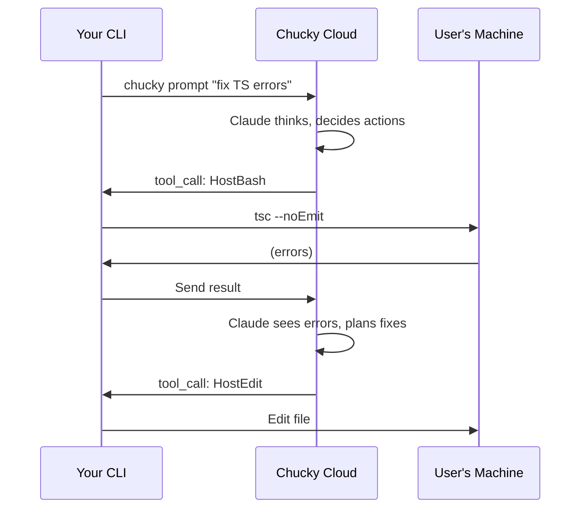

Build powerful CLI tools where Claude reasons in the cloud but executes commands on the user's local machine using Possession Mode.

## What You'll Build

A CLI tool that:
- Accepts natural language commands
- Runs AI reasoning in Chucky's cloud
- Executes file operations and shell commands locally
- Returns results to the user

## Architecture



## Quick Start

The simplest way is using the Chucky CLI directly:

```bash
# Install
npm install -g @chucky.cloud/cli

# Login and init
chucky login
chucky init

# Deploy your workspace
chucky deploy

# Run with Possession Mode
chucky prompt "Fix all TypeScript errors in src/" --allow-possession
```

## How Possession Mode Works

When `--allow-possession` is enabled, Claude gets access to **Host Tools** that execute on the user's machine:

| Tool | Description |
|------|-------------|
| `HostBash` | Execute shell commands |
| `HostRead` | Read files |
| `HostWrite` | Write files |
| `HostEdit` | Find/replace in files |
| `HostGlob` | Find files by pattern |
| `HostGrep` | Search file contents |

Claude reasons in the cloud (where your workspace context exists) but these tools execute locally.

## Building a Custom CLI

### Basic Implementation

```typescript
// my-ai-cli/index.ts
import { ChuckyClient, createToken, createBudget } from '@chucky.cloud/sdk';

async function main() {
  const prompt = process.argv.slice(2).join(' ');

  if (!prompt) {
    console.log('Usage: my-ai-cli "your request"');
    process.exit(1);
  }

  // Create token (in production, get from your server)
  const token = await createToken({
    userId: 'cli-user',
    projectId: process.env.CHUCKY_PROJECT_ID!,
    secret: process.env.CHUCKY_HMAC_SECRET!,
    budget: createBudget({ aiDollars: 1, computeHours: 1, window: 'hour' }),
  });

  const client = new ChuckyClient({ token });
  const session = client.createSession({
    model: 'claude-sonnet-4-5-20250929',
    systemPrompt: {
      type: 'preset',
      preset: 'claude_code',
      append: `You have access to Host tools that execute on the user's machine.
Working directory: ${process.cwd()}`
    },
    allowDangerouslySkipPermissions: true,
  });

  // Stream the response
  await session.send(prompt);
  for await (const msg of session.stream()) {
    if (msg.type === 'assistant') {
      const text = getAssistantText(msg);
      if (text) process.stdout.write(text);
    }
    if (msg.type === 'result') {
      console.log(`\n\nCost: $${msg.total_cost_usd.toFixed(4)}`);
    }
  }

  session.close();
}

main().catch(console.error);
```

### With Host Tool Handlers

For tools to execute locally, you need to handle them in your CLI:

```typescript
import { spawn } from 'child_process';
import { readFile, writeFile } from 'fs/promises';
import { glob } from 'glob';

// Host tool handlers
const hostTools = {
  async HostBash({ command, timeout = 30000 }) {
    return new Promise((resolve) => {
      const proc = spawn('bash', ['-c', command], {
        cwd: process.cwd(),
        timeout,
      });

      let stdout = '';
      let stderr = '';

      proc.stdout.on('data', (data) => stdout += data);
      proc.stderr.on('data', (data) => stderr += data);

      proc.on('close', (code) => {
        resolve({
          content: [{ type: 'text', text: stdout || stderr }],
          isError: code !== 0,
        });
      });
    });
  },

  async HostRead({ path }) {
    try {
      const content = await readFile(path, 'utf-8');
      return { content: [{ type: 'text', text: content }] };
    } catch (err) {
      return { content: [{ type: 'text', text: `Error: ${err.message}` }], isError: true };
    }
  },

  async HostWrite({ path, content }) {
    await writeFile(path, content);
    return { content: [{ type: 'text', text: `Wrote ${content.length} bytes to ${path}` }] };
  },

  async HostGlob({ pattern }) {
    const files = await glob(pattern, { cwd: process.cwd() });
    return { content: [{ type: 'text', text: files.join('\n') }] };
  },
};

// Handle tool calls
session.onToolCall(async (toolCall) => {
  const handler = hostTools[toolCall.name];
  if (handler) {
    return handler(toolCall.input);
  }
  return { content: [{ type: 'text', text: `Unknown tool: ${toolCall.name}` }], isError: true };
});
```

## Use Cases

### Code Refactoring

```bash
my-ai-cli "Refactor all React class components to functional components with hooks"
```

### Bug Fixing

```bash
my-ai-cli "Find and fix the bug causing the login form to submit twice"
```

### Code Review

```bash
my-ai-cli "Review src/api/ for security vulnerabilities and fix any issues"
```

### Test Generation

```bash
my-ai-cli "Generate unit tests for the UserService class"
```

### Documentation

```bash
my-ai-cli "Add JSDoc comments to all exported functions in src/utils/"
```

## Security Considerations

<Warning>
Possession Mode gives Claude the ability to execute arbitrary commands on the user's machine. Only use with trusted prompts and consider these safeguards:
</Warning>

### Recommended Safeguards

1. **Explicit opt-in**: Require `--allow-possession` flag
2. **Confirmation prompts**: Ask before destructive operations
3. **Working directory isolation**: Limit to project directory
4. **Command allowlist**: Restrict which commands can run
5. **Dry-run mode**: Show what would happen before executing

### Example: Confirmation Flow

```typescript
import { confirm } from '@inquirer/prompts';

session.onToolCall(async (toolCall) => {
  if (toolCall.name === 'HostBash') {
    const shouldRun = await confirm({
      message: `Run command: ${toolCall.input.command}?`,
    });

    if (!shouldRun) {
      return { content: [{ type: 'text', text: 'User declined' }], isError: true };
    }
  }

  // Execute tool...
});
```

## Applying Changes

When the AI makes file changes, they're saved in a git bundle. Use the CLI to apply them:

```bash
# Auto-apply changes after completion
chucky prompt "Add error handling to api.ts" --allow-possession --apply

# Or manually
chucky fetch <session-id>
chucky diff <session-id>
chucky apply <session-id>
```

## Best Practices

### 1. Clear System Prompts

Tell Claude what it has access to:

```typescript
systemPrompt: {
  type: 'preset',
  preset: 'claude_code',
  append: `
## Local Execution Context
- Working directory: ${process.cwd()}
- Available commands: npm, node, git, tsc
- Use HostBash for shell commands
- Use HostRead/HostWrite for files
`
}
```

### 2. Progress Feedback

Show users what's happening:

```typescript
for await (const msg of session.stream()) {
  if (msg.type === 'tool_call') {
    console.log(`\n[Tool] ${msg.name}`);
  }
  if (msg.type === 'tool_result') {
    console.log(`[Result] ${msg.content[0]?.text?.slice(0, 100)}...`);
  }
}
```

### 3. Error Recovery

Handle failures gracefully:

```typescript
try {
  await session.send(prompt);
  for await (const msg of session.stream()) {
    // ...
  }
} catch (err) {
  if (err instanceof BudgetExceededError) {
    console.log('Budget limit reached. Upgrade your plan or wait for reset.');
  } else if (err instanceof ConnectionError) {
    console.log('Connection lost. Check your internet connection.');
  } else {
    console.error('Error:', err.message);
  }
}
```

## Next Steps

<CardGroup cols={2}>
  <Card title="Possession Mode" icon="ghost" href="/cli/possession">
    Deep dive into Possession Mode
  </Card>
  <Card title="Git Bundles" icon="code-branch" href="/cli/bundles">
    Managing code changes
  </Card>
  <Card title="Error Handling" icon="triangle-exclamation" href="/advanced/error-handling">
    Handling errors gracefully
  </Card>
  <Card title="Sessions" icon="comments" href="/concepts/sessions">
    Multi-turn conversations
  </Card>
</CardGroup>
