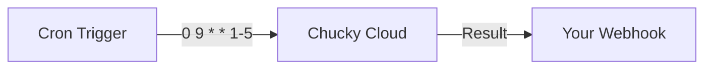

Configure cron jobs to run AI tasks on a schedule - nightly audits, weekly reports, daily maintenance, and more.

## What You'll Build

Automated scheduled tasks that:
- Run at specified times (cron expressions)
- Execute in your deployed workspace
- Have full file and shell access
- Report results via webhooks

## How It Works



## Configuration

Define cron jobs in your `.chucky.json`:

```json
{
  "name": "my-project",
  "crons": [
    {
      "cron": "0 9 * * 1-5",
      "message": "Review all open PRs and post summaries to #dev-updates",
      "timezone": "America/New_York",
      "model": "claude-sonnet-4-5-20250929",
      "maxTurns": 10,
      "maxBudgetUsd": 2.00,
      "systemPrompt": {
        "type": "preset",
        "preset": "claude_code"
      },
      "callback": {
        "url": "https://your-api.com/webhooks/cron",
        "secret": "your-webhook-secret"
      }
    }
  ]
}
```

Then deploy to activate:

```bash
chucky deploy
```

## Cron Expression Reference

```
┌───────────── minute (0-59)
│ ┌───────────── hour (0-23)
│ │ ┌───────────── day of month (1-31)
│ │ │ ┌───────────── month (1-12)
│ │ │ │ ┌───────────── day of week (0-6, Sunday=0)
│ │ │ │ │
* * * * *
```

| Expression | Description |
|------------|-------------|
| `0 9 * * *` | Every day at 9:00 AM |
| `0 9 * * 1-5` | Weekdays at 9:00 AM |
| `0 0 * * 0` | Every Sunday at midnight |
| `0 */6 * * *` | Every 6 hours |
| `0 9 1 * *` | First of every month at 9:00 AM |
| `*/30 * * * *` | Every 30 minutes |

## Use Case Examples

### Daily Code Quality Check

```json
{
  "cron": "0 6 * * *",
  "message": "Run a code quality check:\n1. Find any TODO/FIXME comments older than 30 days\n2. Check for unused imports\n3. Find functions over 50 lines\n4. Identify potential memory leaks\n\nCreate a summary report.",
  "timezone": "UTC",
  "maxBudgetUsd": 1.00
}
```

### Weekly Security Audit

```json
{
  "cron": "0 0 * * 0",
  "message": "Perform a weekly security audit:\n1. Check for outdated dependencies with known vulnerabilities\n2. Scan for hardcoded secrets or API keys\n3. Review authentication/authorization code\n4. Check for SQL injection vulnerabilities\n\nCreate a security report with severity ratings.",
  "timezone": "UTC",
  "model": "claude-opus-4-5-20251101",
  "maxBudgetUsd": 5.00
}
```

### Daily Dependency Updates

```json
{
  "cron": "0 3 * * *",
  "message": "Check for outdated dependencies. For any with minor/patch updates and good changelogs, update them and run tests. Create a summary of changes.",
  "timezone": "UTC",
  "maxBudgetUsd": 2.00
}
```

### Weekly Documentation Sync

```json
{
  "cron": "0 10 * * 1",
  "message": "Review all public functions and classes. Ensure JSDoc comments are accurate and up-to-date. Add missing documentation. Update the API reference in docs/.",
  "timezone": "America/Los_Angeles",
  "maxBudgetUsd": 3.00
}
```

### Nightly Test Coverage Report

```json
{
  "cron": "0 2 * * *",
  "message": "Run the test suite and analyze coverage. Identify untested code paths and critical functions without tests. Generate a coverage report with recommendations.",
  "timezone": "UTC",
  "maxBudgetUsd": 1.00
}
```

### Monthly Compliance Check

```json
{
  "cron": "0 9 1 * *",
  "message": "Run a compliance check for:\n1. License headers on all source files\n2. GDPR data handling compliance\n3. Accessibility (a11y) in UI components\n4. API versioning consistency\n\nGenerate a compliance report.",
  "timezone": "UTC",
  "model": "claude-opus-4-5-20251101",
  "maxBudgetUsd": 10.00
}
```

## Webhook Integration

### Slack Notifications

```typescript
// api/webhooks/cron.ts
export async function POST(req: Request) {
  const payload = await verifyWebhook(req);

  if (payload.status === 'completed') {
    await fetch(process.env.SLACK_WEBHOOK_URL!, {
      method: 'POST',
      headers: { 'Content-Type': 'application/json' },
      body: JSON.stringify({
        text: `*Cron Job Completed*\n\n${payload.output}`,
        channel: '#dev-updates',
      }),
    });
  }

  return new Response('OK');
}
```

### GitHub Issue Creation

```typescript
// api/webhooks/cron.ts
import { Octokit } from '@octokit/rest';

export async function POST(req: Request) {
  const payload = await verifyWebhook(req);

  if (payload.status === 'completed') {
    const octokit = new Octokit({ auth: process.env.GITHUB_TOKEN });

    await octokit.issues.create({
      owner: 'your-org',
      repo: 'your-repo',
      title: `Weekly Report - ${new Date().toISOString().split('T')[0]}`,
      body: payload.output,
      labels: ['automated', 'report'],
    });
  }

  return new Response('OK');
}
```

### Email Reports

```typescript
// api/webhooks/cron.ts
import { Resend } from 'resend';

export async function POST(req: Request) {
  const payload = await verifyWebhook(req);

  if (payload.status === 'completed') {
    const resend = new Resend(process.env.RESEND_API_KEY);

    await resend.emails.send({
      from: 'reports@your-domain.com',
      to: ['team@your-domain.com'],
      subject: `AI Report - ${payload.task}`,
      text: payload.output,
    });
  }

  return new Response('OK');
}
```

## Configuration Options

### Full Schema

```json
{
  "crons": [
    {
      "cron": "0 9 * * *",
      "message": "Task description",
      "timezone": "America/New_York",
      "model": "claude-sonnet-4-5-20250929",
      "maxTurns": 10,
      "maxBudgetUsd": 5.00,
      "systemPrompt": {
        "type": "preset",
        "preset": "claude_code",
        "append": "Additional context..."
      },
      "tools": {
        "type": "preset",
        "preset": "claude_code"
      },
      "allowedTools": ["Read", "Write", "Bash"],
      "disallowedTools": ["dangerous_tool"],
      "permissionMode": "bypassPermissions",
      "callback": {
        "url": "https://your-api.com/webhook",
        "secret": "hmac-secret"
      }
    }
  ]
}
```

### Option Reference

| Option | Type | Description |
|--------|------|-------------|
| `cron` | `string` | Cron expression |
| `message` | `string` | Prompt to send |
| `timezone` | `string` | IANA timezone (default: UTC) |
| `model` | `string` | Model to use |
| `maxTurns` | `number` | Maximum conversation turns |
| `maxBudgetUsd` | `number` | Budget limit for this job |
| `systemPrompt` | `object` | System prompt configuration |
| `tools` | `object` | Tool configuration |
| `allowedTools` | `string[]` | Whitelist of tools |
| `disallowedTools` | `string[]` | Blacklist of tools |
| `permissionMode` | `string` | Permission handling |
| `callback` | `object` | Webhook configuration |

## Managing Cron Jobs

### View Active Jobs

```bash
# List jobs (includes cron-triggered jobs)
chucky jobs list
```

### Update Schedule

Edit `.chucky.json` and redeploy:

```bash
chucky deploy
```

### Disable Temporarily

Comment out or remove the cron entry and deploy:

```json
{
  "crons": [
    // Temporarily disabled
    // { "cron": "0 9 * * *", "message": "..." }
  ]
}
```

### Test Before Scheduling

Run the prompt manually first:

```bash
chucky prompt "Your cron message here"
```

## Best Practices

### 1. Set Budget Limits

Always set `maxBudgetUsd` to prevent runaway costs:

```json
{
  "cron": "0 * * * *",
  "maxBudgetUsd": 0.50
}
```

### 2. Use Appropriate Models

- **Haiku** for simple, frequent tasks
- **Sonnet** for most tasks (good balance)
- **Opus** for complex analysis (sparingly)

### 3. Handle Failures

Configure webhooks to alert on failures:

```typescript
if (payload.status === 'failed') {
  await alertTeam(`Cron job failed: ${payload.error}`);
}
```

### 4. Stagger Schedules

Don't run all jobs at the same time:

```json
{
  "crons": [
    { "cron": "0 6 * * *", "message": "Task 1" },
    { "cron": "0 7 * * *", "message": "Task 2" },
    { "cron": "0 8 * * *", "message": "Task 3" }
  ]
}
```

### 5. Keep Prompts Focused

One task per cron job:

```json
// Good
{ "message": "Check for outdated dependencies" }

// Avoid
{ "message": "Check dependencies, run tests, update docs, and deploy" }
```

## Monitoring

### View Job History

```bash
chucky jobs list --limit 50
```

### Check Specific Job

```bash
chucky jobs get <job-id>
```

### Cost Tracking

Monitor costs in the Chucky portal at [app.chucky.cloud](https://app.chucky.cloud).

## Next Steps

<CardGroup cols={2}>
  <Card title="Jobs" icon="list-check" href="/cli/jobs">
    Manual job management
  </Card>
  <Card title="Deployment" icon="rocket" href="/cli/deployment">
    Deploy configuration
  </Card>
  <Card title="CI/CD Integration" icon="git-branch" href="/use-cases/cicd">
    Pipeline integration
  </Card>
  <Card title="Budget Management" icon="wallet" href="/advanced/budget-management">
    Cost control
  </Card>
</CardGroup>
