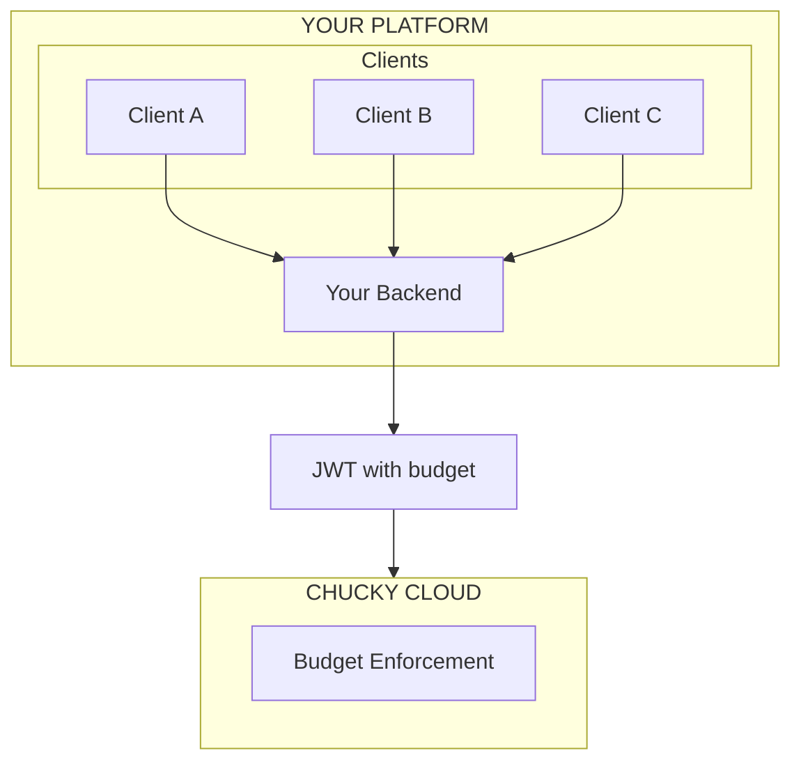

Build a multi-tenant AI platform where each client gets their own branded experience with automatic per-user billing. No Stripe metering code required.

## What You'll Build

A platform that:
- Serves multiple clients/organizations
- Enforces per-user and per-organization budgets
- Tracks usage automatically
- Bills based on actual consumption
- Requires zero custom metering code

## Architecture



## How Budget Enforcement Works

1. **Your server** creates JWT tokens with embedded budgets
2. **Chucky** validates tokens and tracks usage
3. **When budget depletes**, requests are rejected
4. **Usage data** returned with each response

No database queries. No usage counters. No race conditions. Budget enforcement happens at the edge.

## Implementation

### 1. Define Subscription Tiers

```typescript
// config/plans.ts
export const plans = {
  free: {
    aiDollars: 0.50,      // $0.50/month AI budget
    computeHours: 0.5,    // 30 minutes compute
    maxTurns: 5,          // 5 turns per conversation
    model: 'claude-3-5-haiku-20241022',
  },
  starter: {
    aiDollars: 10,        // $10/month AI budget
    computeHours: 5,      // 5 hours compute
    maxTurns: 20,
    model: 'claude-sonnet-4-5-20250929',
  },
  pro: {
    aiDollars: 50,        // $50/month AI budget
    computeHours: 20,     // 20 hours compute
    maxTurns: 100,
    model: 'claude-sonnet-4-5-20250929',
  },
  enterprise: {
    aiDollars: 500,       // $500/month AI budget
    computeHours: 100,    // 100 hours compute
    maxTurns: null,       // Unlimited turns
    model: 'claude-opus-4-5-20251101',
  },
};
```

### 2. Token Generation Endpoint

```typescript
// pages/api/ai/token.ts (Next.js example)
import { createToken, createBudget } from '@chucky.cloud/sdk';
import { plans } from '@/config/plans';

export async function POST(req: Request) {
  // Your authentication
  const user = await getCurrentUser(req);
  if (!user) {
    return Response.json({ error: 'Unauthorized' }, { status: 401 });
  }

  // Get user's organization and plan
  const org = await getOrganization(user.orgId);
  const plan = plans[org.plan] || plans.free;

  // Create token with plan-specific budget
  const token = await createToken({
    userId: user.id,
    projectId: process.env.CHUCKY_PROJECT_ID!,
    secret: process.env.CHUCKY_HMAC_SECRET!,
    expiresIn: 3600, // 1 hour
    budget: createBudget({
      aiDollars: plan.aiDollars,
      computeHours: plan.computeHours,
      window: 'month',
      windowStart: org.billingCycleStart, // Align with billing
    }),
    permissions: {
      maxTurns: plan.maxTurns,
      model: plan.model, // Force plan's model
    },
    sdkConfig: {
      // Override any client-side options
      model: plan.model,
    },
  });

  return Response.json({ token });
}
```

### 3. Client Integration

```typescript
// Client-side (React example)
import { ChuckyClient, getAssistantText } from '@chucky.cloud/sdk';
import { useState } from 'react';

export function AIChat() {
  const [messages, setMessages] = useState([]);
  const [input, setInput] = useState('');

  async function sendMessage() {
    // Get fresh token from your server
    const { token } = await fetch('/api/ai/token', {
      method: 'POST',
      credentials: 'include',
    }).then(r => r.json());

    const client = new ChuckyClient({ token });
    const session = client.createSession();

    setMessages(prev => [...prev, { role: 'user', content: input }]);
    setInput('');

    await session.send(input);

    let response = '';
    for await (const msg of session.stream()) {
      if (msg.type === 'assistant') {
        response += getAssistantText(msg) || '';
        setMessages(prev => {
          const updated = [...prev];
          const lastIdx = updated.length - 1;
          if (updated[lastIdx]?.role === 'assistant') {
            updated[lastIdx].content = response;
          } else {
            updated.push({ role: 'assistant', content: response });
          }
          return updated;
        });
      }
      if (msg.type === 'result') {
        // Track usage for analytics
        trackUsage(msg.total_cost_usd, msg.usage);
      }
    }

    session.close();
  }

  return (
    <div>
      {messages.map((m, i) => (
        <div key={i} className={m.role}>{m.content}</div>
      ))}
      <input value={input} onChange={e => setInput(e.target.value)} />
      <button onClick={sendMessage}>Send</button>
    </div>
  );
}
```

### 4. Usage Tracking (Optional)

Track usage for your dashboard:

```typescript
// lib/usage.ts
export async function trackUsage(userId: string, cost: number, tokens: object) {
  await db.usageEvents.create({
    userId,
    costUsd: cost,
    inputTokens: tokens.input_tokens,
    outputTokens: tokens.output_tokens,
    timestamp: new Date(),
  });
}

// Get usage for billing
export async function getUsage(orgId: string, startDate: Date, endDate: Date) {
  const usage = await db.usageEvents.aggregate({
    where: {
      user: { orgId },
      timestamp: { gte: startDate, lte: endDate },
    },
    _sum: { costUsd: true },
  });
  return usage._sum.costUsd || 0;
}
```

## Multi-Tenancy Patterns

### Per-Organization Projects

Each client gets their own Chucky project:

```typescript
// When onboarding a new client
const project = await chuckyAdmin.createProject({
  name: `client-${client.id}`,
  anthropicApiKey: client.ownApiKey, // Optional: use their API key
});

// Store project credentials
await db.clients.update({
  where: { id: client.id },
  data: {
    chuckyProjectId: project.id,
    chuckyHmacKey: project.hmacKey,
  },
});
```

### Shared Project with User Isolation

All clients share one project, isolated by userId:

```typescript
// Token identifies the specific tenant
const token = await createToken({
  userId: `${org.id}:${user.id}`, // Composite ID
  // ... budget based on org's plan
});
```

### Custom Workspaces per Client

Each client has their own codebase:

```typescript
// Deploy client-specific workspace
await chuckyCli.deploy({
  projectId: client.chuckyProjectId,
  folder: `./workspaces/${client.id}`,
});
```

## Handling Budget Exceeded

```typescript
import { BudgetExceededError } from '@chucky.cloud/sdk';

try {
  await session.send(message);
  for await (const msg of session.stream()) {
    // ...
  }
} catch (err) {
  if (err instanceof BudgetExceededError) {
    // Show upgrade prompt
    return {
      error: 'budget_exceeded',
      message: 'You have reached your monthly AI limit.',
      upgradeUrl: `/billing/upgrade?plan=starter`,
    };
  }
  throw err;
}
```

## Usage Dashboard

Build a dashboard showing:

```typescript
// pages/api/usage/dashboard.ts
export async function GET(req: Request) {
  const user = await getCurrentUser(req);
  const org = await getOrganization(user.orgId);
  const plan = plans[org.plan];

  const currentUsage = await getUsage(
    org.id,
    org.billingCycleStart,
    new Date()
  );

  return Response.json({
    plan: org.plan,
    budget: {
      ai: {
        used: currentUsage,
        limit: plan.aiDollars,
        percentage: (currentUsage / plan.aiDollars) * 100,
      },
    },
    cycleEnds: getNextBillingDate(org.billingCycleStart),
  });
}
```

## Pricing Your Platform

### Cost-Plus Model

```typescript
const platformMarkup = 1.5; // 50% markup

const plans = {
  starter: {
    // Your cost: $10 AI budget
    // You charge: $10 * 1.5 = $15/month
    price: 15,
    aiDollars: 10,
  },
};
```

### Usage-Based Add-on

```typescript
// Base subscription + overage
const pricing = {
  starter: {
    basePrice: 29,
    includedAI: 10, // $10 included
    overageRate: 1.2, // 20% markup on overage
  },
};

function calculateBill(org) {
  const usage = await getUsage(org.id, ...);
  const overage = Math.max(0, usage - pricing[org.plan].includedAI);
  return pricing[org.plan].basePrice + (overage * pricing[org.plan].overageRate);
}
```

## Best Practices

### 1. Short-Lived Tokens

```typescript
// Create tokens that expire quickly
const token = await createToken({
  expiresIn: 900, // 15 minutes
  // ...
});

// Refresh before expiry
if (isTokenExpiring(token)) {
  token = await refreshToken();
}
```

### 2. Graceful Degradation

```typescript
// When approaching budget limit
if (remainingBudget < 0.10) {
  // Switch to cheaper model
  session.options.model = 'claude-3-5-haiku-20241022';
  // Reduce max turns
  session.options.maxTurns = 3;
}
```

### 3. Audit Logging

```typescript
// Log all AI interactions
await auditLog.create({
  userId: user.id,
  orgId: org.id,
  action: 'ai_request',
  prompt: message.slice(0, 500), // Truncated for privacy
  cost: result.total_cost_usd,
  model: session.options.model,
  timestamp: new Date(),
});
```

### 4. Rate Limiting

Even with budget limits, add rate limiting:

```typescript
import { Ratelimit } from '@upstash/ratelimit';

const ratelimit = new Ratelimit({
  limiter: Ratelimit.slidingWindow(10, '1m'), // 10 requests/minute
});

const { success } = await ratelimit.limit(user.id);
if (!success) {
  return Response.json({ error: 'Too many requests' }, { status: 429 });
}
```

## Next Steps

<CardGroup cols={2}>
  <Card title="Authentication" icon="key" href="/authentication">
    Deep dive into token creation
  </Card>
  <Card title="Budget Management" icon="wallet" href="/advanced/budget-management">
    Advanced budget strategies
  </Card>
  <Card title="Error Handling" icon="triangle-exclamation" href="/advanced/error-handling">
    Handle errors gracefully
  </Card>
  <Card title="Billing" icon="credit-card" href="/billing">
    Understanding costs
  </Card>
</CardGroup>
